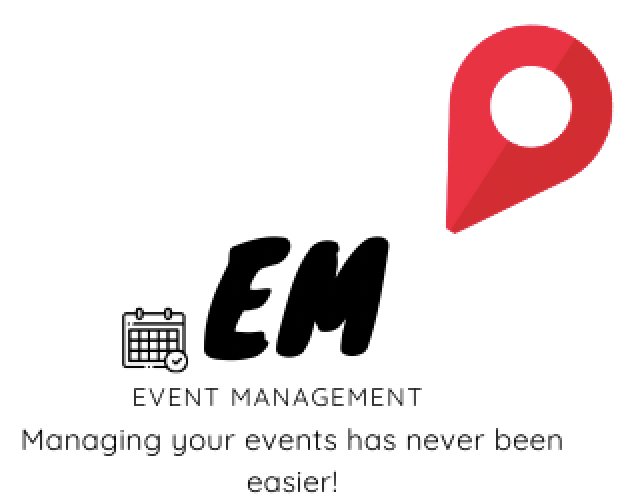

# Trabalho Pratico PAW

## :computer: Gestão de Eventos culturais 

  

## API

---

## Descrição

Este projeto tem por objetivo desenvolver uma API para a web, que seja capaz de fazer:

* Gestão de utilizadores;
* Gestão de eventos e locais de eventos culturais;
* Gestão de bilhetes.

#### Funcionamento do site

Para aceder à página promotor é necessário ter uma conta do tipo **promotor** e estar com **login** feito.
Um promotor pode ver gerir os seus eventos e as localizações na página **promotor**. 

## ℹ️ Como iniciar o servidor

1. Fazer clone ao repositório;
2. Dentro do diretório do projeto executar o comando `npm install` para instalar todas as dependências necessárias; 
3. Executar o comando `npm start` para iniciar o servidor (`localhost:3000`).

---

## 📦️ Packages utilizados

<table>
<tr>
<td>

+ **[Nodemon](http://nodemon.io)** 

</td>
<td>

+ **[Body-Parser](https://www.npmjs.com/package/body-parser)** 

</td>
<td>

+ **[Mongoose](https://mongoosejs.com)** 

</td>
<tr>
<td>

+ **[Morgan](https://www.npmjs.com/package/morgan)** 

</td>
<td>

+ **[Express-Fileupload](https://www.npmjs.com/package/express-fileupload)** 

</td>

<td>

+ **[Ejs](https://ejs.co)** 

</td>

</tr>

<tr>
<td>

+ **[Cookie-Parser](https://www.npmjs.com/package/cookie-parser)** 

</td>
</tr>

</tr>
</table>

---

## Ferramentas

* VSCODE - IDE onde foi desenvolvido o Software
* JavaScript – Linguagem utilizada para o desenvolvimento do projeto
* GitLab – Controlo de versões, definição e distribuição das tarefas atribuídas aos elementos da equipa
* Microsoft Teams – Plataforma de comunicação dos elementos da equipa
* Zoom - Plataforma de comunicação dos elementos da equipa

---

## Equipa

* João Bragança
* Micael Sampaio
* Flavio Costa

---

**Escola Superior de Tecnologia e Gestão - P.Porto**
